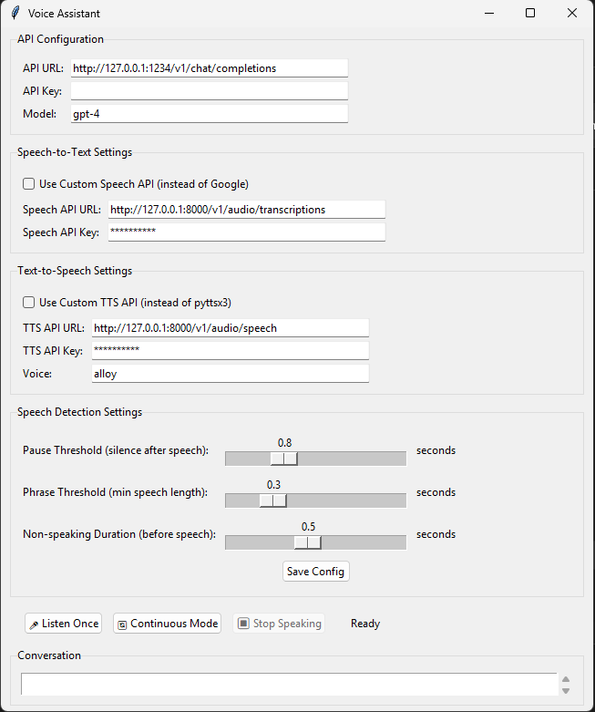

# Voice Assistant

A lightweight, self-hosted voice assistant with support for customizable speech-to-text and text-to-speech APIs. Works with any OpenAI-compatible API including local LLMs.

## Features

- 🎤 **Voice Input** - Speech recognition using Google or custom STT API
- 🤖 **AI Responses** - OpenAI-compatible API support (OpenAI, LM Studio, Ollama, etc.)
- 🔊 **Voice Output** - Text-to-speech using system TTS or custom API
- 🔄 **Continuous Mode** - Keep-alive conversational mode
- ⚙️ **Adjustable Detection** - Fine-tune speech detection thresholds
- 🎯 **System Prompts** - Guide AI behavior for concise, conversational responses
- ⏱️ **Configurable Timeout** - Adjust request timeout for long responses (30-300 seconds)
- 📑 **Tabbed Interface** - Clean main interface with organized settings tab
- 🏠 **Self-Hosted** - Full support for local/offline operation
- 🪶 **Lightweight** - Simple GUI, minimal dependencies
- 🔒 **Privacy-First** - Run everything locally if desired

## Screenshots



## Quick Start

### Windows

1. **Download the repository**
2. **Run the installer:**
   - Right-click `install.bat`
   - Select "Run as administrator"
   - Follow the prompts
3. **Launch:** Double-click `launch.bat`

### Linux

1. **Download the repository**
2. **Make installer executable:**
   ```bash
   chmod +x install.sh
   ```
3. **Run the installer:**
   ```bash
   ./install.sh
   ```
4. **Launch:**
   ```bash
   ./launch.sh
   ```

## Installation

### Automatic Installation (Recommended)

#### Windows
The `install.bat` script will:
- Check for Python and install if needed (Python 3.11.7)
- Install all required dependencies
- Handle tricky PyAudio installation
- Create launcher script
- Optionally create desktop shortcut

#### Linux
The `install.sh` script supports:
- **Ubuntu/Debian/Linux Mint/Pop!_OS**
- **Fedora/RHEL/CentOS**
- **Arch Linux/Manjaro**
- **openSUSE**

It will:
- Detect your distribution
- Check for Python and offer to install
- Install system dependencies (PortAudio, FFmpeg, espeak)
- Install Python packages
- Create launcher script
- Optionally create desktop shortcut

### Manual Installation

If you prefer manual installation:

1. **Install Python 3.8+** from [python.org](https://www.python.org/downloads/)

2. **Install system dependencies:**

   **Windows:** No additional system packages needed

   **Ubuntu/Debian:**
   ```bash
   sudo apt-get install python3-pip python3-dev portaudio19-dev python3-pyaudio ffmpeg espeak
   ```

   **Fedora:**
   ```bash
   sudo dnf install python3-pip python3-devel portaudio-devel ffmpeg espeak
   ```

   **Arch Linux:**
   ```bash
   sudo pacman -S python-pip portaudio python-pyaudio ffmpeg espeak
   ```

3. **Install Python dependencies:**
   ```bash
   pip install SpeechRecognition pyttsx3 requests pyaudio pydub
   ```

   If PyAudio fails on Windows:
   ```bash
   pip install pipwin
   pipwin install pyaudio
   ```

4. **Run:**
   ```bash
   python voice-assistant.py
   ```

## Configuration

### First-Time Setup

#### For LM Studio (Local LLM - Recommended)
1. Start LM Studio and load a model
2. In Voice Assistant, configure:
   - **API URL:** `http://127.0.0.1:1234/v1/chat/completions`
   - **API Key:** `not-needed`
   - **Model:** `local-model`
3. Click **Save Config**

#### For OpenAI
1. Get your API key from [platform.openai.com](https://platform.openai.com)
2. Configure:
   - **API URL:** `https://api.openai.com/v1/chat/completions`
   - **API Key:** Your OpenAI API key
   - **Model:** `gpt-4` or `gpt-3.5-turbo`
3. Click **Save Config**

#### For Other Services
Works with any OpenAI-compatible API:
- **Ollama** (with OpenAI compatibility layer)
- **text-generation-webui**
- **vLLM**
- **LocalAI**
- **Anthropic** (with compatibility layer)

### Speech Detection Settings

Fine-tune when the assistant stops listening:

- **Pause Threshold** (0.3-2.0s): Silence after speech before stopping
  - Lower = more responsive, may cut you off
  - Higher = waits longer, won't interrupt
  - **Recommended:** 0.8s

- **Phrase Threshold** (0.1-1.0s): Minimum speech length to process
  - Filters out very short sounds
  - **Recommended:** 0.3s

- **Non-speaking Duration** (0.1-1.0s): Silence before listening starts
  - Helps filter background noise
  - **Recommended:** 0.5s

### Custom Speech-to-Text API (Optional)

Use your own STT instead of Google Speech Recognition:

1. Check **"Use Custom Speech API"**
2. Enter API URL (e.g., `http://127.0.0.1:8000/v1/audio/transcriptions`)
3. Enter API Key (or `not-needed` for local)
4. Click **Save Config**

**Expected API format (OpenAI Whisper-compatible):**
- **Method:** POST
- **Content-Type:** multipart/form-data
- **Fields:** `file` (audio.wav), `model` (whisper-1)
- **Response:** `{"text": "transcribed text"}`

**Compatible services:**
- Faster-Whisper
- Whisper.cpp
- OpenAI Whisper API
- Groq Whisper API

### Custom Text-to-Speech API (Optional)

Use your own TTS instead of system voice:

1. Check **"Use Custom TTS API"**
2. Enter API URL (e.g., `http://127.0.0.1:8000/v1/audio/speech`)
3. Enter API Key (or `not-needed` for local)
4. Enter Voice name (e.g., `alloy`, `echo`, `fable`, `onyx`, `nova`, `shimmer`)
5. Click **Save Config**

**Expected API format (OpenAI TTS-compatible):**
- **Method:** POST
- **Content-Type:** application/json
- **Body:** `{"model": "tts-1", "input": "text", "voice": "alloy"}`
- **Response:** Audio file (MP3/WAV)

**Compatible services:**
- Coqui TTS
- Piper TTS
- OpenAI TTS API
- ElevenLabs API

## Usage

### Single Question Mode
1. Click **"🎤 Listen Once"**
2. Speak your question
3. Wait for the response

### Continuous Conversation Mode
1. Click **"🔄 Continuous Mode"**
2. Speak naturally - the assistant will keep listening after each response
3. Click **"⏹ Stop Continuous"** to exit

### Stop Speaking
Click **"⏹ Stop Speaking"** to interrupt the current response

## Self-Hosted Setup (Complete Privacy)

Run everything locally for full privacy and offline operation:

### 1. Local LLM
- **LM Studio** (easiest): https://lmstudio.ai/
- **Ollama**: https://ollama.com/
- **text-generation-webui**: https://github.com/oobabooga/text-generation-webui

### 2. Local Speech-to-Text
- **Faster-Whisper**: https://github.com/guillaumekln/faster-whisper
- **Whisper.cpp**: https://github.com/ggerganov/whisper.cpp
- **Vosk**: https://alphacephei.com/vosk/

### 3. Local Text-to-Speech
- **Coqui TTS**: https://github.com/coqui-ai/TTS
- **Piper**: https://github.com/rhasspy/piper
- **Mozilla TTS**: https://github.com/mozilla/TTS

### Example Fully Local Setup
```bash
# Terminal 1: Start local LLM
lmstudio serve

# Terminal 2: Start Whisper API
faster-whisper-server --host 127.0.0.1 --port 8000

# Terminal 3: Start TTS API
piper-tts-server --host 127.0.0.1 --port 8001

# Terminal 4: Run Voice Assistant
python voice-assistant.py
```

Configure Voice Assistant to use:
- **Chat API:** `http://127.0.0.1:1234/v1/chat/completions`
- **STT API:** `http://127.0.0.1:8000/v1/audio/transcriptions`
- **TTS API:** `http://127.0.0.1:8001/v1/audio/speech`

## Troubleshooting

### Windows

#### Python not found
- Restart computer after installing Python
- Ensure "Add Python to PATH" was checked during installation
- Re-run `install.bat`

#### PyAudio installation fails
```bash
pip install pipwin
pipwin install pyaudio
```
Or download from: https://www.lfd.uci.edu/~gohlke/pythonlibs/#pyaudio

#### Microphone not working
- Check Windows Settings → Privacy → Microphone
- Allow apps to access microphone

### Linux

#### PyAudio module not found
```bash
# Ubuntu/Debian
sudo apt-get install python3-pyaudio

# Fedora
sudo dnf install python3-pyaudio

# Arch
sudo pacman -S python-pyaudio
```

#### Microphone permission denied
```bash
sudo usermod -a -G audio $USER
# Log out and log back in
```

#### ALSA warnings
These are usually harmless. To suppress:
```bash
export PYTHONWARNINGS="ignore"
python3 voice-assistant.py
```

### Common Issues (All Platforms)

#### Google Speech Recognition errors
- Check internet connection
- May have rate limits
- Consider using custom STT API

#### API connection errors
- Verify API URL is correct
- Check that local server is running
- Check firewall settings
- Ensure no typos in configuration

#### No sound output
- Check default audio device settings
- Test with system sounds
- Try restarting the application

#### Poor speech recognition
- Adjust speech detection thresholds
- Use a better quality microphone
- Reduce background noise
- Consider custom STT API

## System Requirements

- **OS:** Windows 10/11, Linux (any modern distro)
- **Python:** 3.8 or higher
- **RAM:** 500MB minimum (more for local LLMs)
- **Disk:** 100MB for app + space for models if self-hosting
- **Audio:** Microphone and speakers/headphones
- **Internet:** Optional (only needed for cloud APIs)

## Project Structure

```
voice-assistant/
├── voice-assistant.py      # Main application
├── install.bat             # Windows installer
├── install.sh              # Linux installer
├── launch.bat              # Windows launcher (created by installer)
├── launch.sh               # Linux launcher (created by installer)
└── README.md               # This file
```

## Configuration File

Settings are automatically saved to:
- **Windows:** `C:\Users\YourUsername\.voice_assistant_config.json`
- **Linux:** `~/.voice_assistant_config.json`

You can manually edit this file if needed.

## Development

### Running from Source
```bash
python voice-assistant.py
```

### Modifying the Code
The application is a single Python file (`voice-assistant.py`) using:
- **tkinter** - GUI
- **SpeechRecognition** - STT
- **pyttsx3** - TTS (local)
- **requests** - API calls

Feel free to fork and customize!

## Contributing

Contributions are welcome! Please feel free to submit pull requests or open issues for bugs and feature requests.

## License

GNU General Public License v3.0 (GPLv3) - Free to use, modify, and distribute. Any modifications must also be released under GPLv3. See [LICENSE](LICENSE) for full details.

This ensures the software remains free and open source for everyone.

## Acknowledgments

- Built with Python and Tkinter
- Uses SpeechRecognition by [Uberi](https://github.com/Uberi/speech_recognition)
- Uses pyttsx3 for text-to-speech
- Compatible with OpenAI API format

## Support

For issues or questions:
1. Check the Troubleshooting section above
2. Review console output for error messages
3. Open an issue on GitHub with:
   - Operating system and version
   - Python version
   - Error messages
   - Steps to reproduce

## Roadmap

Potential future features:
- [ ] Conversation history with context
- [ ] Multiple conversation profiles
- [ ] Wake word detection
- [ ] Custom voice training
- [ ] Multi-language support
- [ ] Voice activity detection (VAD)
- [ ] Plugin system for extensions
- [ ] Mobile app version

## Privacy

- **No telemetry** - The application doesn't collect or send any usage data
- **Local-first** - All processing can be done locally
- **Config stored locally** - Settings saved on your machine only
- **API keys secure** - Stored locally, never transmitted except to your configured endpoints

When using cloud APIs (Google Speech Recognition, OpenAI, etc.), their respective privacy policies apply.

